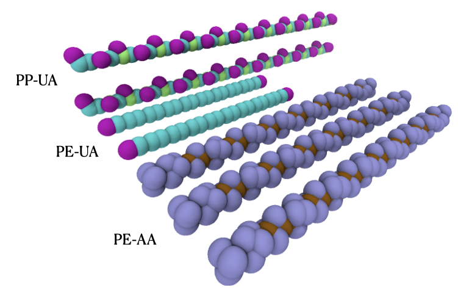

# AutoPoly.py: Automatic Generation of Data File for Polymers

## How to use AutoPoly.py?
First, we need to include the package in the python PATH
```python
import sys
sys.path.append('package_path')
import AutoPoly
```

Then, you can try AutoPoly.py

```python

# Define the system
# out is the folder name for the output
system=AutoPoly.System(out="test")

# create polymers
# Just an example of polypropylene and polyethylene with all-atom and united-atom resolutions
PPUA=AutoPoly.Polymer(ChainNum=2,Sequence=["PPUA"]*20)
PEUA=AutoPoly.Polymer(ChainNum=2,Sequence=["PEUA"]*10)
PEAA=AutoPoly.Polymer(ChainNum=3,Sequence=["PEAA"]*15)

# polymerization
# Name is the output folder for this polymer
poly=AutoPoly.Polymerization(Name="Polymer",System=system,Model=[PPUA,PEUA,PEAA],run=True)
```
you will get something looks like this using Visual Molecular Dynamics:


## Monomer Bank

Monomer data is created by Avogadra [https://avogadro.cc/]

## Acknowledge

"Moltemplate: A Tool for Coarse-Grained Modeling of Complex Biological Matter and Soft Condensed Matter Physics", J. Mol. Biol., 2021, 433(11):166841, Jewett AI, Stelter D, Lambert J, Saladi SM, Roscioni OM; Ricci M, Autin L, Maritan M, Bashusqeh SM, Keyes T, Dame RT; Shea J-E, Jensen GJ, Goodsell DS https://doi.org/10.1016/j.jmb.2021.166841


## To-do list
* Support tacticity of polymers
* Support inclusion of small molecules
* Support creation of coarse-grained polymers