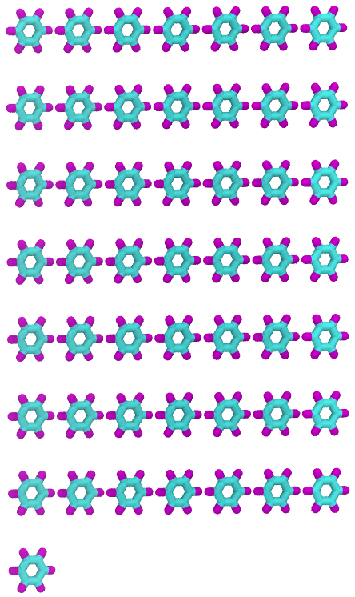

# AutoPoly.py: Automatic Generation of Data File for Polymers

* Support OPLS (Optimized Potentials for Liquid Simulations) force field that was developed by Prof. William L. Jorgensen at Purdue University and later at Yale University.

## Why AutoPoly?

It can create polymers with any chain length!


## Version update

* Tacticity supported

## Support Polymers

1. PMMA
2. PS
3. PE
4. PI
5. PP
6. PVA

## How to use AutoPoly.py?
Install AutoPoly via pip:
```bash
pip install AutoPoly
```

Load package AutoPoly in python script
```python
import AutoPoly
```

### Create polymer system with PP PE chains at AA, UA levels
```python
# Define the system
# out is the folder name for the output
system=AutoPoly.System(out="test")

# create polymers
# Just an example of polypropylene and polyethylene with all-atom and united-atom resolutions
PPUA=AutoPoly.Polymer(ChainNum=2,Sequence=["PPUA"]*20)
PEUA=AutoPoly.Polymer(ChainNum=2,Sequence=["PEUA"]*10)
PEAA=AutoPoly.Polymer(ChainNum=3,Sequence=["PEAA"]*15)

# polymerization
# Name is the output folder for this polymer
poly=AutoPoly.Polymerization(Name="Polymer",System=system,Model=[PPUA,PEUA,PEAA],run=True)
```
you will get something looks like this using Visual Molecular Dynamics:


### Create molecular system with 50 benzenes
```python

# Define the system
# out is the folder name for the output
system=AutoPoly.System(out="test_molecule")

# create polymers
# Just an example of benzene with all-atom resolutions
benzene=AutoPoly.Polymer(ChainNum=50,Sequence=["Benzene"])

# polymerization
# Name is the output folder for this polymer
poly=AutoPoly.Polymerization(Name="Benzene",System=system,Model=[benzene],run=True)
```
you will get something looks like this using Visual Molecular Dynamics:


## Monomer Bank

Monomer data is created by Avogadra [https://avogadro.cc/]

## RDkit
AutoPoly supports create molecules from RDkit directly and store them in monomer_bank for future use 
```python
rdlt=AutoPoly.RDlt(smiles='c1c2ccccc2ccc1')
rdlt.run(to_file='Naphthalene.lt')
rdlt.store_bank()# flag=True/False to store or not in the monomer bank, default: True

# Define the system
# out is the folder name for the output
system=AutoPoly.System(out="test_molecule_from_RDkit")

# create polymers
# Just an example of naphthalene with all-atom resolutions
naphthalene=AutoPoly.Polymer(ChainNum=50,Sequence=["Naphthalene"])

# polymerization
# Name is the output folder for this polymer
poly=AutoPoly.Polymerization(Name="Naphthalene",System=system,Model=[naphthalene],run=True)
```

## Acknowledge

"Moltemplate: A Tool for Coarse-Grained Modeling of Complex Biological Matter and Soft Condensed Matter Physics", J. Mol. Biol., 2021, 433(11):166841, Jewett AI, Stelter D, Lambert J, Saladi SM, Roscioni OM; Ricci M, Autin L, Maritan M, Bashusqeh SM, Keyes T, Dame RT; Shea J-E, Jensen GJ, Goodsell DS https://doi.org/10.1016/j.jmb.2021.166841

"rdlt": Script to automate assignment of atom types and build .lt files for use with moltemplate and the OPLS and L-OPLS forcefields that come packaged with it. https://github.com/asteeves/rdlt

## To-do list
* Support coarse-grained polymers